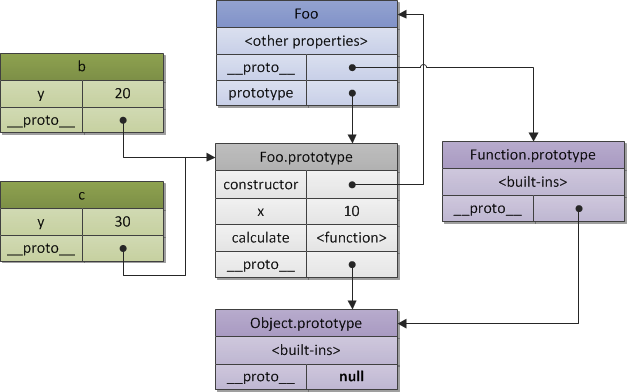
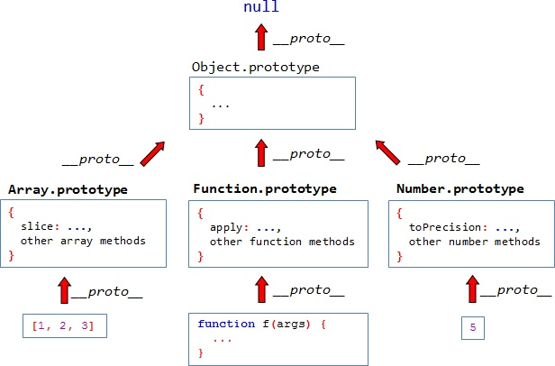

# JavaScript 全栈教程

> 本文档是我学习廖老师的教程时所作的笔记，廖老师原教程的地址：
[JavaScript教程](https://www.liaoxuefeng.com/wiki/001434446689867b27157e896e74d51a89c25cc8b43bdb3000)
---
### JavaScript简介
- JavaScript历史

    Brendan Eich两周之内设计出了JavaScript语言。
- ECMAScript

	ECMAScript是一种语言标准，而JavaScript是网景公司对ECMAScript标准的一种实现。
- JavaScript版本
	
	2015年6月正式发布了ECMAScript 6标准。


### 1 快速入门
#### 1.1 基本语法

#### 1.2 数据类型和变量
	
	在JavaScript中，同一个变量可以反复赋值，而且可以是不同类型的变量。这种变量本身类型不固定的语言称之为动态语言。
	
``` JavaScript
var a = 123;
a = 'ABC';
```
	静态语言在定义变量时必须指定变量类型，如果赋值的时候类型不匹配，就会报错。例如Java是静态语言。
``` Java
int a = 123;
a = 'ABC'	// 错误：不能把字符串赋给整形变量
```

#### 1.3 字符串

##### 1.3.1 模板字符串
	
	把多个字符串连接起来，可以用 + 号连接：
``` JavaScript
var name = 'rain';
var age = 18;
var message = 'Hello, I am ' + name + '. I am ' + age + ' years old.';
console.log(message);
```
    ES6新增了一种模板字符串：
``` JavaScript
var name = 'rain';
var age = 18;
var message = `Hello, I am ${name}. I am ${age} years old`;
console.log(message);
```
##### 1.3.2 字符串常用方法
**toUpperCase()**
``` JavaScript
var str = 'Hello';
str.toUpperCase();	// 'HELLO'
``` 
**toLowerCase()**
``` JavaScript
var str = 'Hello';
str.toLowerCase();	// 'hello'
``` 
**indexOf()**
``` JavaScript
var str = 'hello, world';
str.indexOf('world');		// 7
str.indexOf('World');		// 没有找到指定的子串，返回 -1
``` 
**substring()**
``` JavaScript
var str = 'hello, world';
str.substring(0, 5);		// 从索引0开始到5（不包括5），返回'hello'
str.substring(7);			// 从索引7开始到结束，返回'world'
``` 
	Note: 调用这些方法本身不会改变原有字符串的内容，而是返回一个新字符串
	
#### 1.4 数组
##### 1.4.1 索引
``` JavaScript
var arr = [1, 2, 3];
arr[5] = 'x';
arr;       // arr变为[1, 2, 3, undefined, undefined, 'x']
```
Note: 大多数其他编程语言不允许直接改变数组的大小，越界访问索引会报错。然而，JavaScript的Array却不会有任何错误。
在编写代码时，不建议直接修改Array的大小，访问索引时要确保索引不会越界。

##### 1.4.2 数组常用方法
**indexOf**
``` JavaScript
var arr = [10, 20, '30', 'xyz'];
arr.indexOf(10);    // 0
arr.indexOf(20);    // 1
arr.indexOf(30);    // -1
arr.indexOf('30');  // 2
```
**slice**
> slice()就是对应String的substring()版本，截取Array的部分元素，然后返回一个新的Array

``` JavaScript
var arr = ['a', 'b', 'c', 'd', 'e'];
arr.slice(0, 3);    // ['a', 'b', 'c']
arr.slice(3);       // ['d', 'e']

var aCopy = arr.slice();    //  复制Array
aCopy;             // ['a', 'b', 'c', 'd', 'e']
aCopy === arr;     // false
```
**push & pop**
``` JavaScript
var arr = [1, 2];
arr.push('a', 'b');	// 4
arr;				// [1, 2, 'a', 'b']
arr.pop();          // 'b'
arr;				// [1, 2, 'a']
arr.pop();
arr.pop();
arr.pop();
arr;				// []
arr.pop();			// 空数组继续pop不会报错，而是返回undefined
arr;				// []
```
**unshift & shift**
``` JavaScript
var arr = [1, 2];
arr.unshift('a', 'b');  // 4
arr;                // ['a', 'b', 1, 2]
arr.shift();        // 'a'
arr;                // ['b', 1, 2]
arr.shift();
arr.shift();
arr.shift();
arr;                // []
arr.shift();        // undefined
arr;                // []
```
**sort**
``` JavaScript
var arr = ['b', 'c', 'a'];
arr.sort();
arr;                // ['a', 'b', 'c']
```
**reverse**
``` JavaScript
var arr = ['a', 'b', 'c'];
arr.reverse();
arr;                // ['c', 'b', 'a']
```
**splice**
> 修改Array的“万能方法”，它可以从指定的索引开始删除若干元素，然后再从该位置添加若干元素

``` JavaScript
var arr = ['Microsoft', 'Apple', 'Yahoo', 'AOL', 'Excite', 'Oracle'];

// 从索引2开始删除3个元素,然后再添加两个元素:
arr.splice(2, 3, 'Google', 'Facebook'); // 返回删除的元素 ['Yahoo', 'AOL', 'Excite']
arr;                                    // ['Microsoft', 'Apple', 'Google', 'Facebook', 'Oracle']
```
**concat**
``` JavaScript
var arr = ['a', 'b', 'c'];
var added = arr.concat([1, 2, 3]);
added;		// ['a', 'b', 'c', 1, 2, 3]
arr;		// ['a', 'b', 'c']
```
**join**
``` JavaScript
var arr = ['a', 'b', 'c', 1, 2, 3];
arr.join('-');     // 'a-b-c-1-2-3'
```
#### 1.5 对象
> JavaScript对象的所有属性都是字符串，不过属性对应的值可以是任意数据类型。

> JavaScript规定，访问不存在的属性不报错，而是返回undefined。

> 要判断一个属性是否是对象自身拥有的，而不是继承得到的，可以用hasOwnProperty()方法。

#### 1.6 条件判断
``` JavaScript
if () {
	// ...
} else {
	// ...
}

if () {
	// ...
} else if () {
	// ...
} else {
	// ...
}
```
#### 1.7 循环
**for...in**
> for...in 把一个对象的所有属性依次循环出来

``` JavaScript
var o = {
    name: 'rain',
    age: 18,
    city: 'shenzhen'
};
for (var key in o) {
    console.log(key);   // 'name' 'age' 'city'
}
```

> 要过滤掉对象继承的属性，用hasOwnProperty()来实现：

``` JavaScript
var o = {
    name: 'rain',
    age: 18,
    city: 'shenzhen'
};
for (var key in o) {
    if (o.hasOwnProperty(key)) {
        console.log(key);   // 'name' 'age' 'city'
    }
}
```

#### 1.8 Map和Set
**Map**
> Map是一组键值对的结构，具有极快的查找速度。

**Set**
> Set和Map类似，也是一组key的集合，但不存储value。由于key不能重复，所以，在Set中，没有重复的key。

Note: Map和Set是ES6标准新增的数据类型。

#### 1.9 iterable
> 遍历Array可以采用下标循环，遍历Map和Set就无法使用下标。为了统一集合类型，ES6标准引入了新的iterable类型，Array、Map和Set都属于iterable类型。

**for...of循环遍历集合**
``` JavaScript
var a = ['A', 'B', 'C'];
var s = new Set(['A', 'B', 'C']);
var m = new Map([[1, 'x'], [2, 'y'], [3, 'z']]);
for (var x of a) { // 遍历Array
    console.log(x);
}
for (var x of s) { // 遍历Set
    console.log(x);
}
for (var x of m) { // 遍历Map
    console.log(x[0] + '=' + x[1]);
}
```
**for...of循环和for...in循环有何区别**
> for...in循环由于历史遗留问题，它遍历的实际上是对象的属性名称。一个Array数组实际上也是一个对象，它的每个元素的索引被视为一个属性。

``` JavaScript
var a = ['A', 'B', 'C'];
a.name = 'Hello';
for (var x in a) {
    console.log(x); // '0', '1', '2', 'name'
}
```

``` JavaScript
var a = ['A', 'B', 'C'];
a.name = 'Hello';
for (var x of a) {
    console.log(x); // 'A', 'B', 'C'
}
```

**iterable内置的forEach方法**
> 它接收一个函数，每次迭代就自动回调该函数。

``` JavaScript
var a = ['A', 'B', 'C'];
a.forEach(function (element, index, array) {
    // element: 指向当前元素的值
    // index: 指向当前索引
    // array: 指向Array对象本身
    console.log(element);
});
```

### 2 函数
> JavaScript的函数不但是“头等公民”，而且可以像变量一样使用，具有非常强大的抽象能力。

#### 2.1 函数定义和调用
> 函数体内部的语句在执行时，一旦执行到return时，函数就执行完毕，并将结果返回。如果没有return语句，函数执行完毕后也会返回结果，只是结果为undefined。

**arguments**
``` JavaScript
// foo(a[, b], c)
// 接收2~3个参数，b是可选参数，如果只传2个参数，b默认为null

function foo(a, b, c) {
    if (arguments.length === 2) {
        // 实际拿到的参数是a和b，c为undefined
        c = b;      // 把b赋给c
        b = null;   // b变为默认值
    }
    // ...
}
```

**...rest参数**
> rest参数只能写在最后，前面用...标识

``` JavaScript
function foo(a, b, ...rest) {
    console.log('a = ' + a);
    console.log('b = ' + b);
    console.log(rest);
}

foo(1, 2, 3, 4, 5);
// 结果:
// a = 1
// b = 2
// Array [ 3, 4, 5 ]

foo(1);
// 结果:
// a = 1
// b = undefined
// Array []
```

**return语句的一个大坑**
``` JavaScript
function foo() {
    return
        { name: 'foo' };
}

foo(); // undefined
```
> 由于JavaScript引擎在行末自动添加分号的机制，上面的代码实际上变成了：

``` JavaScript
function foo() {
    return;                 // 自动添加了分号，相当于return undefined;
        { name: 'foo' };    // 这行语句已经没法执行到了
}
```
> 正确的多行写法是：

``` JavaScript
function foo() {
    return {         // 这里不会自动加分号，因为{表示语句尚未结束
        name: 'foo'
    };
}
```

#### 2.2 变量作用域
**变量提升**
> JavaScript的函数定义有个特点，它会先扫描整个函数体的语句，把所有申明的变量“提升”到函数顶部。

**全局作用域**
> 不在任何函数内定义的变量就具有全局作用域。实际上，JavaScript默认有一个全局对象window，全局作用域的变量实际上被绑定到window的一个属性。

> JavaScript实际上只有一个全局作用域。任何变量（函数也视为变量），如果没有在当前函数作用域中找到，就会继续往上查找，最后如果在全局作用域中也没有找到，则报ReferenceError错误。

**名字空间**
> 全局变量会绑定到window上，不同的JavaScript文件如果使用了相同的全局变量，或者定义了相同名字的顶层函数，都会造成命名冲突，并且很难被发现。

> 减少冲突的一个方法是把自己的所有变量和函数全部绑定到一个全局变量中。许多著名的JavaScript库都是这么干的：jQuery，YUI，underscore等等。例如：

``` JavaScript
// 唯一的全局变量MYAPP:
var MYAPP = {};

// 其他变量:
MYAPP.name = 'myapp';
MYAPP.version = 1.0;

// 其他函数:
MYAPP.foo = function () {
    return 'foo';
};
```

**局部作用域**
> 为了解决块级作用域，ES6引入了新的关键字let，用let替代var可以申明一个块级作用域的变量。

``` JavaScript
'use strict';

function foo() {
    var sum = 0;
    for (let i=0; i<100; i++) {
        sum += i;
    }
    i += 1; // SyntaxError
}
```

**常量**
> ES6标准引入了新的关键字const来定义常量，const与let都具有块级作用域：

``` JavaScript
'use strict';

const PI = 3.14;
PI = 3; // 某些浏览器不报错，但是无效果！
PI;     // 3.14
```

#### 2.3 方法
> 在一个对象中绑定函数，称为这个对象的方法。

``` JavaScript
function getAge() {
    var y = new Date().getFullYear();
    return y - this.birth;
}

var o = {
    name: 'rain',
    birth: 1992,
    age: getAge
};

o.age();    // 25, 正常结果
getAge();   // NaN
```
> 如果以对象的方法形式调用，比如o.age()，该函数的this指向被调用的对象，也就是o，这是符合我们预期的。
如果单独调用函数，比如getAge()，此时，该函数的this指向全局对象，也就是window。

> 由于这是一个巨大的设计错误，要想纠正可没那么简单。ECMA决定，在strict模式下让函数的this指向undefined。
这个决定只是让错误及时暴露出来，并没有解决this应该指向的正确位置。

``` JavaScript
'use strict';

var o = {
    name: 'rain',
    birth: 1992,
    age: function () {
        function getAgeFromBirth() {
            var y = new Date().getFullYear();
            return y - this.birth;
        }
        return getAgeFromBirth();
    }
};

o.age(); // Uncaught TypeError: Cannot read property 'birth' of undefined
```
> this指针只在age方法的函数内指向o，在函数内部定义的函数，this又指向undefined了！（在非strict模式下，它重新指向全局对象window！）

**修复的办法 var that = this**
``` JavaScript
'use strict';

var o = {
    name: 'rain',
    birth: 1992,
    age: function () {
        var that = this;            // 在方法内部一开始就捕获this
        function getAgeFromBirth() {
            var y = new Date().getFullYear();
            return y - that.birth;  // 用that而不是this
        }
        return getAgeFromBirth();
    }
};
```

**apply & call**
``` JavaScript
function getAge() {
    var y = new Date().getFullYear();
    return y - this.birth;
}

var o = {
    name: 'rain',
    birth: 1992,
    age: getAge
};

o.age();    // 25
getAge.apply(o, []);   // 25
```

**装饰器**
> 利用apply()，我们还可以动态改变函数的行为。JavaScript的所有对象都是动态的，即使内置的函数，我们也可以重新指向新的函数。

``` JavaScript
var count = 0;
var oldParseInt = parseInt; // 保存原函数

window.parseInt = function () {
    count += 1;
    return oldParseInt.apply(null, arguments); // 调用原函数
};

// 测试:
parseInt('10');
parseInt('20');
parseInt('30');
count; // 3
```

#### 2.4 高阶函数
> JavaScript的函数其实都指向某个变量。既然变量可以指向函数，函数的参数能接收变量，那么一个函数就可以接收另一个函数作为参数，这种函数就称之为高阶函数。

``` JavaScript
function add(x, y, f) {
    return f(x) + f(y);
}
add(-5, 6, Math.abs)
```
**map**
``` JavaScript
function pow(x) {
    return x * x;
}

var arr = [1, 2, 3, 4, 5, 6, 7, 8, 9];
arr.map(pow); // [1, 4, 9, 16, 25, 36, 49, 64, 81]
```
> 把Array的所有数字转为字符串:

``` JavaScript
var arr = [1, 2, 3, 4, 5, 6, 7, 8, 9];
arr.map(String); // ['1', '2', '3', '4', '5', '6', '7', '8', '9']
```

**reduce**
> 这个函数必须接收两个参数，reduce()把结果继续和序列的下一个元素做累积计算，其效果就是：

> [x1, x2, x3, x4].reduce(f) = f(f(f(x1, x2), x3), x4)

``` JavaScript
var arr = [1, 3, 5, 7, 9];
arr.reduce(function (x, y) {
    return x + y;
}); // 25
```

**filter**
> filter()把传入的函数依次作用于每个元素，然后根据返回值是true还是false决定保留还是丢弃该元素。

> 把一个Array中的空字符串删掉

``` JavaScript
var arr = ['A', '', 'B', null, undefined, 'C', '  '];
var r = arr.filter(function (s) {
    return s && s.trim();   // 注意：IE9以下的版本没有trim()方法
});
r;                          // ['A', 'B', 'C']
```

> filter()接收的回调函数，其实可以有多个参数。通常我们仅使用第一个参数，表示Array的某个元素。回调函数还可以接收另外两个参数，表示元素的位置和数组本身：

``` JavaScript
var arr = ['A', 'B', 'C'];
var r = arr.filter(function (element, index, self) {
    console.log(element);   // 依次打印'A', 'B', 'C'
    console.log(index);     // 依次打印0, 1, 2
    console.log(self);      // self就是变量arr
    return true;
});
```

> 利用filter，可以巧妙地去除Array的重复元素：

``` JavaScript
'use strict';

var r,
    arr = ['apple', 'strawberry', 'banana', 'pear', 'apple', 'orange', 'orange', 'strawberry'];
    
    r = arr.filter(function (element, index, self) {
    return self.indexOf(element) === index;
    
    console.log(r.toString());
});

```
**sort**
> 通常规定，对于两个元素x和y，如果认为x < y，则返回-1，如果认为x == y，则返回0，如果认为x > y，则返回1，这样，排序算法就不用关心具体的比较过程，而是根据比较结果直接排序。

>Array的sort()方法默认把所有元素先转换为String再根据ASCII码进行排序。

``` JavaScript
var arr = [10, 20, 1, 2];
arr.sort(function (x, y) {
    if (x < y) {
        return -1;
    }
    if (x > y) {
        return 1;
    }
    return 0;
}); // [1, 2, 10, 20]
```

``` JavaScript
var arr = ['Google', 'apple', 'Microsoft'];
arr.sort(function (s1, s2) {
    var x1 = s1.toUpperCase(),
        x2 = s2.toUpperCase();
    if (x1 < x2) {
        return -1;
    }
    if (x1 > x2) {
        return 1;
    }
    return 0;
}); // ['apple', 'Google', 'Microsoft']
```

#### 2.5 闭包
> 在面向对象的程序设计语言里，比如Java和C++，要在对象内部封装一个私有变量，可以用private修饰一个成员变量。
在没有class机制，只有函数的语言里，借助闭包，同样可以封装一个私有变量。我们用JavaScript创建一个计数器：

``` JavaScript
'use strict';

function create_counter(initial) {
    var x = initial || 0;
    return {
        inc: function () {
            x += 1;
            return x;
        }
    }
}

var c1 = create_counter();
c1.inc(); // 1
c1.inc(); // 2
c1.inc(); // 3

var c2 = create_counter(10);
c2.inc(); // 11
c2.inc(); // 12
c2.inc(); // 13
```

#### 2.6 箭头函数
> 引用博客文章：[少年，不要滥用箭头函数啊](https://jingsam.github.io/2016/12/08/things-you-should-know-about-arrow-functions.html)
---
- 箭头函数是什么？
> lambda演算深刻影响了箭头函数的设计。数学家们喜欢用纯函数式编程语言，纯函数的特点是没有副作用，给予特定的输入，总是产生确定的输出，甚至有些情况下通过输出能够反推输入。要实现纯函数，必须使函数的执行过程不依赖于任何外部状态，整个函数就像一个数学公式，给定一套输入参数，不管是在地球上还是火星上执行都是同一个结果。

> 箭头函数要实现类似纯函数的效果，必须剔除外部状态。所以当你定义一个箭头函数，在普通函数里常见的this、arguments、caller是统统没有的。

- 箭头函数没有this
> 箭头函数没有this，那下面的代码明显可以取到this啊。以下箭头函数中的this其实是父级作用域中的this，即函数foo的this。箭头函数引用了父级的变量，构成了一个闭包。

``` JavaScript
function foo() {
  this.a = 1
  let b = () => console.log(this.a)
  b()
}
foo()  // 1
```
> 一个经常犯的错误是使用箭头函数定义对象的方法，如：

``` JavaScript
let a = {
  foo: 1,
  bar: () => console.log(this.foo)
}
a.bar()  //undefined
```
> 以上代码中，箭头函数中的this并不是指向a这个对象。对象a并不能构成一个作用域，所以再往上到达全局作用域，this就指向全局作用域。如果我们使用普通函数的定义方法，输出结果就符合预期。

> 另一个错误是在原型上使用箭头函数，如：

``` JavaScript
function A() {
  this.foo = 1
}
A.prototype.bar = () => console.log(this.foo)
let a = new A()
a.bar()  //undefined
```
- 什么情况下该使用箭头函数
1. 箭头函数适合于无复杂逻辑或者无副作用的纯函数场景下，例如用在map、reduce、filter的回调函数定义中；
2. 不要在最外层定义箭头函数，因为在函数内部操作this会很容易污染全局作用域。最起码在箭头函数外部包一层普通函数，将this控制在可见的范围内；
3. 如开头所述，箭头函数最吸引人的地方是简洁。在有多层函数嵌套的情况下，箭头函数的简洁性并没有很大的提升，反而影响了函数的作用范围的识别度，这种情况不建议使用箭头函数。

#### 2.7 generator
> generator和函数不同的是，generator由function\*定义（注意多出的\*号），并且，除了return语句，还可以用yield返回多次。

> 以一个著名的斐波那契数列为例，它由0，1开头：0 1 1 2 3 5 8 13 21 34 ...

``` JavaScript
function* fib(max) {
    var
        t,
        a = 0,
        b = 1,
        n = 1;
    while (n < max) {
        yield a;
        t = a + b;
        a = b;
        b = t;
        n ++;
    }
    return a;
}

fib(5); // fib {[[GeneratorStatus]]: "suspended", [[GeneratorReceiver]]: Window}
```
> 直接调用一个generator和调用函数不一样，fib(5)仅仅是创建了一个generator对象，还没有去执行它。

1. 调用generator对象有两个方法，一是不断地调用generator对象的next()方法：

``` JavaScript
var f = fib(5);
f.next(); // {value: 0, done: false}
f.next(); // {value: 1, done: false}
f.next(); // {value: 1, done: false}
f.next(); // {value: 2, done: false}
f.next(); // {value: 3, done: true}
```
2. 第二个方法是直接用for ... of循环迭代generator对象，这种方式不需要我们自己判断done
``` JavaScript
for (var x of fib(5)) {
    console.log(x); // 依次输出0, 1, 1, 2, 3
}
```

### 3 标准对象
有这么几条规则需要遵守：
- 不要使用new Number()、new Boolean()、new String()创建包装对象；
- 用parseInt()或parseFloat()来转换任意类型到number；
- 用String()来转换任意类型到string，或者直接调用某个对象的toString()方法；
- 通常不必把任意类型转换为boolean再判断，因为可以直接写if (myVar) {...}；
- typeof操作符可以判断出number、boolean、string、function和undefined；
- 判断Array要使用Array.isArray(arr)；
- 判断null请使用myVar === null；
- 判断某个全局变量是否存在用typeof window.myVar === 'undefined'；
- 函数内部判断某个变量是否存在用typeof myVar === 'undefined'。

#### 3.1 Date
**1. 要获取系统当前时间，用：**
``` JavaScript
var now = new Date();
now;                // Wed Oct 25 2017 23:31:24 GMT+0800 (中国标准时间)
now.getFullYear();  // 2017, 年份
now.getMonth();     // 9, 月份，注意月份范围是0~11，9表示十月
now.getDate();      // 25, 表示25号
now.getDay();       // 3, 表示星期三
now.getHours();     // 23, 24小时制
now.getMinutes();   // 31, 分钟
now.getSeconds();   // 24, 秒
now.getMilliseconds(); // 254, 毫秒数
now.getTime();      // 1508945484254, 以number形式表示的时间戳
```
> 注意，当前时间是浏览器从本机操作系统获取的时间，所以不一定准确，因为用户可以把当前时间设定为任何值。

---
**2. 时区**
> Date对象表示的时间总是按浏览器所在时区显示的，不过我们既可以显示本地时间，也可以显示调整后的UTC时间：

``` JavaScript
var d = new Date(1435146562875);
d.toLocaleString(); // '2015/6/24 下午7:49:22'，本地时间（北京时区+8:00），显示的字符串与操作系统设定的格式有关
d.toUTCString();    // 'Wed, 24 Jun 2015 11:49:22 GMT'，UTC时间，与本地时间相差8小时
```
> 那么在JavaScript中如何进行时区转换呢？实际上，只要我们传递的是一个number类型的时间戳，我们就不用关心时区转换。任何浏览器都可以把一个时间戳正确转换为本地时间。

---
**3. 时间戳**
> 时间戳是个什么东西？时间戳是一个自增的整数，它表示从1970年1月1日零时整的GMT时区开始的那一刻，到现在的毫秒数。假设浏览器所在电脑的时间是准确的，那么世界上无论哪个时区的电脑，它们此刻产生的时间戳数字都是一样的，所以，时间戳可以精确地表示一个时刻，并且与时区无关。
所以，**我们只需要传递时间戳，或者把时间戳从数据库里读出来，再让JavaScript自动转换为当地时间就可以了**。

要获取当前时间戳，可以用：
``` JavaScript
if (Date.now) {
    console.log(Date.now()); // 老版本IE没有now()方法
} else {
    console.log(new Date().getTime());
}
```

#### 3.2 RegExp
> 正则表达式是一种用来匹配字符串的强有力的武器。它的设计思想是用一种描述性的语言来给字符串定义一个规则，凡是符合规则的字符串，我们就认为它“匹配”了，否则，该字符串就是不合法的。

---
1. 在正则表达式中，如果直接给出字符，就是精确匹配。用\d可以匹配一个数字，\w可以匹配一个字母或数字，所以：
- '00\d'可以匹配'007'，但无法匹配'00A'；
- '\d\d\d'可以匹配'010'；
- '\w\w'可以匹配'js'；
---
2. \d{3}\s+\d{3,8}
> 该正则表达式可以匹配以任意个空格隔开的带区号的电话号码。

- \d{3}表示匹配3个数字，例如'010'；
- \s可以匹配一个空格（也包括Tab等空白符），所以\s+表示至少有一个空格，例如匹配' '，'\t\t'等；
- \d{3,8}表示3-8个数字，例如'1234567'。

3. 在JavaScript中使用正则表达式
- 第一种方式是直接通过/正则表达式/写出来，第二种方式是通过new RegExp('正则表达式')创建一个RegExp对象。

``` JavaScript
var re1 = /ABC\-001/;
var re2 = new RegExp('ABC\\-001');

re1; // /ABC\-001/
re2; // /ABC\-001/
```
- RegExp对象的test()方法用于测试给定的字符串是否符合条件。

``` JavaScript
var re = /^\d{3}\-\d{3,8}$/;
re.test('010-12345'); // true
re.test('010-1234x'); // false
re.test('010 12345'); // false
```
- 切分字符串
``` JavaScript
'a b   c'.split(' '); // ['a', 'b', '', '', 'c']

'a b   c'.split(/\s+/); // ['a', 'b', 'c']
```

- 提取子串
> 如果正则表达式中定义了组，就可以在RegExp对象上用exec()方法提取出子串来。
exec()方法在匹配成功后，会返回一个Array，第一个元素是正则表达式匹配到的整个字符串，后面的字符串表示匹配成功的子串。
exec()方法在匹配失败时返回null。

``` JavaScript
// 从匹配的字符串中提取出区号和本地号码
var re = /^(\d{3})-(\d{3,8})$/;
re.exec('010-12345'); // ['010-12345', '010', '12345']
re.exec('010 12345'); // null
```
- 全局搜索

``` JavaScript
var s = 'JavaScript, VBScript, JScript and ECMAScript';
var re=/[a-zA-Z]+Script/g;

// 使用全局匹配:
re.exec(s); // ['JavaScript']
re.lastIndex; // 10

re.exec(s); // ['VBScript']
re.lastIndex; // 20

re.exec(s); // ['JScript']
re.lastIndex; // 29

re.exec(s); // ['ECMAScript']
re.lastIndex; // 44

re.exec(s); // null，直到结束仍没有匹配到
```

#### 3.3 JSON
> JSON是JavaScript Object Notation的缩写，它是一种数据交换格式。JSON还定死了字符集必须是UTF-8，表示多语言就没有问题了。为了统一解析，JSON的字符串规定必须用双引号""，Object的键也必须用双引号""。

>把任何JavaScript对象变成JSON，就是把这个对象序列化成一个JSON格式的字符串，这样才能够通过网络传递给其他计算机。
如果我们收到一个JSON格式的字符串，只需要把它反序列化成一个JavaScript对象，就可以在JavaScript中直接使用这个对象了。

- 序列化

``` JavaScirpt
var o = {
    name: 'rain',
    age: 25,
    gender: 'male',
    grade: null,
    skills: ['HTML', 'CSS', 'JavaScript', 'Node.js']
};

JSON.stringify(o);
// "{"name":"rain","age":25,"gender":"male","grade":null,"skills":["HTML","CSS","JavaScript","Node.js"]}"

JSON.stringify(o, null, '  ');  // 按缩进输出

JSON.stringify(o, ['name', 'skills', 'age'], '  '); // 输出指定的属性

function convert(key, value) {
    if (typeof value === 'string') {
        return value.toUpperCase();
    }
    return value;
}

JSON.stringify(o, convert, '  ');   // 传入一个函数，这样对象的每个键值对都会被函数先处理
```

- 反序列化
拿到一个JSON格式的字符串，我们直接用JSON.parse()把它变成一个JavaScript对象：
``` JavaScript
JSON.parse('[1,2,3,true]'); // [1, 2, 3, true]
JSON.parse('{"name":"rain","age":25}'); // Object {name: 'rain', age: 25}
JSON.parse('true'); // true
JSON.parse('123.45'); // 123.45
```

JSON.parse()还可以接收一个函数，用来转换解析出的属性：
``` JavaScript
JSON.parse('{"name":"rain","age":25}', function (key, value) {
    if (key === 'name') {
        return value + '同学';
    }
    return value;
}); // Object {name: 'rain同学', age: 25}
```

### 4 面向对象编程
**__proto__和prototype**
> 图片摘取知乎问题 [javascript中__proto__和prototype的区别？](https://www.zhihu.com/question/44335170)中的回答


---

---

---
> Note: 1.在JS里，万物皆对象。方法（Function）是对象，方法的原型(Function.prototype)是对象。因此，它们都会具有对象共有的特点。即：对象具有属性__proto__，可称为隐式原型，一个对象的隐式原型指向构造该对象的构造函数的原型，这也保证了实例能够访问在构造函数原型中定义的属性和方法。

>2.方法(Function)方法这个特殊的对象，除了和其他对象一样有上述_proto_属性之外，还有自己特有的属性——原型属性（prototype），这个属性是一个指针，指向一个对象，这个对象的用途就是包含所有实例共享的属性和方法（我们把这个对象叫做原型对象）。原型对象也有一个属性，叫做constructor，这个属性包含了一个指针，指回原构造函数。


#### 4.1 创建对象

#### 4.2 原型继承

``` JavaScript
function inherit(subclass, superclass) {
    var _prototype = Object.create(superclass.prototype)
    _prototype.constructor = subclass
    subclass.prototype = _prototype
}

// Shape - superclass
function Shape() {
    this.x = 0
    this.y = 0
}

// superclass method
Shape.prototype.move = function(x, y) {
    this.x += x
    this.y += y
    console.log('Shape moved. this.x = ' + this.x + ' this.y = ' + this.y)
}

// Rectangle - subclass
function Rectangle() {
    Shape.call(this)
}

// subclass extends superclass
// Rectangle.prototype = Object.create(Shape.prototype)
// Rectangle.prototype.constructor = Rectangle
inherit(Rectangle, Shape)

var rect = new Rectangle()

rect.move(2, 2)
```


#### 4.3 class继承
> class的定义包含了构造函数constructor和定义在原型对象上的函数hello()（注意没有function关键字）。PrimaryStudent的定义也是class关键字实现的，而extends则表示原型链对象来自Student。

``` JavaScript
class Student {
    constructor(name) {
        this.name = name
    }

    hello() {
        console.log('hello ' + this.name)
    }
}

class PrimaryStudent extends Student {
    constructor(name, grade) {
        super(name)    // 记得用super调用父类的构造方法
        this.grade = grade
    }

    myGrade() {
        console.log('I am at grade ' + this.grade)
    }
}
```
### 5 浏览器

#### 5.1 浏览器对象
- **window**
> window对象有innerWidth和innerHeight属性，可以获取浏览器窗口的内部宽度和高度。内部宽高是指除去菜单栏、工具栏、边框等占位元素后，用于显示网页的净宽高。对应的，还有一个outerWidth和outerHeight属性，可以获取浏览器窗口的整个宽高。(兼容性：IE<=8不支持。)

- **navigator**
1. navigator.appName：浏览器名称；
2. navigator.appVersion：浏览器版本；
3. navigator.language：浏览器设置的语言；
4. navigator.platform：操作系统类型；
5. navigator.userAgent：浏览器设定的User-Agent字符串。
> 请注意，navigator的信息可以很容易地被用户修改，所以JavaScript读取的值不一定是正确的。很多初学者为了针对不同浏览器编写不同的代码，喜欢用if判断浏览器版本，例如：

``` JavaScript
var width;
if (getIEVersion(navigator.userAgent) < 9) {
    width = document.body.clientWidth;
} else {
    width = window.innerWidth;
}
```
> 但这样既可能判断不准确，也很难维护代码。正确的方法是充分利用JavaScript对不存在属性返回undefined的特性，直接用短路运算符||计算：

``` JavaScript
var width = window.innerWidth || document.body.clientWidth;
```

- **screen**
1. screen.width：屏幕宽度，以像素为单位；
2. screen.height：屏幕高度，以像素为单位；
3. screen.colorDepth：返回颜色位数，如8、16、24。

- **location**
``` JavaScript
location.href       // http://www.example.com:8080/path/index.html?a=1&b=2#TOP
location.protocol;  // 'http'
location.host;      // 'www.example.com'
location.port;      // '8080'
location.pathname;  // '/path/index.html'
location.search;    // '?a=1&b=2'
location.hash;      // 'TOP'

location.assign('/discuss')   // 加载一个新页面
location.reload()   // 重新加载当前页面
```

- **document**

1. document.title  // 浏览器窗口标题
2. document.getElementById()       // 按ID获得一个DOM节点
3. document.getElementsByTagName() // 按Tag名称获得一组DOM节点

4. document.cookie // 获取当前页面的Cookie
> Cookie是由服务器发送的key-value标示符。因为HTTP协议是无状态的，但是服务器要区分到底是哪个用户发过来的请求，就可以用Cookie来区分。当一个用户成功登录后，服务器发送一个Cookie给浏览器，例如user=ABC123XYZ(加密的字符串)...，此后，浏览器访问该网站时，会在请求头附上这个Cookie，服务器根据Cookie即可区分出用户。

> 由于JavaScript能读取到页面的Cookie，而用户的登录信息通常也存在Cookie中，这就造成了巨大的安全隐患，这是因为在HTML页面中引入第三方的JavaScript代码是允许的：

``` JavaScript
<!-- 当前页面在www.example.com -->
<html>
    <head>
        <script src="http://www.foo.com/jquery.js"></script>
    </head>
    ...
</html>
```

> 如果引入的第三方的JavaScript中存在恶意代码，则www.foo.com网站将直接获取到www.example.com网站的用户登录信息。

> 为了解决这个问题，服务器在设置Cookie时可以使用httpOnly，设定了httpOnly的Cookie将不能被JavaScript读取。这个行为由浏览器实现，主流浏览器均支持httpOnly选项，IE从IE6 SP1开始支持。

> 为了确保安全，服务器端在设置Cookie时，应该始终坚持使用httpOnly。

#### 5.2 操作DOM

#### 5.3 操作表单

#### 5.4 操作文件

#### 5.5 AJAX

#### 5.6 Promise

#### 5.7 Canvas

