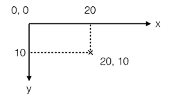

# JavaScript 全栈教程

> 本文档是我学习廖老师的教程时所作的笔记，廖老师原教程的地址：
[JavaScript教程](https://www.liaoxuefeng.com/wiki/001434446689867b27157e896e74d51a89c25cc8b43bdb3000)
---
### JavaScript简介
- JavaScript历史

    Brendan Eich两周之内设计出了JavaScript语言。
- ECMAScript

	ECMAScript是一种语言标准，而JavaScript是网景公司对ECMAScript标准的一种实现。
- JavaScript版本
	
	2015年6月正式发布了ECMAScript 6标准。


### 1 快速入门
#### 1.1 基本语法

#### 1.2 数据类型和变量
	
	在JavaScript中，同一个变量可以反复赋值，而且可以是不同类型的变量。这种变量本身类型不固定的语言称之为动态语言。
	
``` JavaScript
var a = 123;
a = 'ABC';
```
	静态语言在定义变量时必须指定变量类型，如果赋值的时候类型不匹配，就会报错。例如Java是静态语言。
``` Java
int a = 123;
a = 'ABC'	// 错误：不能把字符串赋给整形变量
```

#### 1.3 字符串

##### 1.3.1 模板字符串
	
	把多个字符串连接起来，可以用 + 号连接：
``` JavaScript
var name = 'rain';
var age = 18;
var message = 'Hello, I am ' + name + '. I am ' + age + ' years old.';
console.log(message);
```
    ES6新增了一种模板字符串：
``` JavaScript
var name = 'rain';
var age = 18;
var message = `Hello, I am ${name}. I am ${age} years old`;
console.log(message);
```
##### 1.3.2 字符串常用方法
**toUpperCase()**
``` JavaScript
var str = 'Hello';
str.toUpperCase();	// 'HELLO'
``` 
**toLowerCase()**
``` JavaScript
var str = 'Hello';
str.toLowerCase();	// 'hello'
``` 
**indexOf()**
``` JavaScript
var str = 'hello, world';
str.indexOf('world');		// 7
str.indexOf('World');		// 没有找到指定的子串，返回 -1
``` 
**substring()**
``` JavaScript
var str = 'hello, world';
str.substring(0, 5);		// 从索引0开始到5（不包括5），返回'hello'
str.substring(7);			// 从索引7开始到结束，返回'world'
``` 
	Note: 调用这些方法本身不会改变原有字符串的内容，而是返回一个新字符串
	
#### 1.4 数组
##### 1.4.1 索引
``` JavaScript
var arr = [1, 2, 3];
arr[5] = 'x';
arr;       // arr变为[1, 2, 3, undefined, undefined, 'x']
```
Note: 大多数其他编程语言不允许直接改变数组的大小，越界访问索引会报错。然而，JavaScript的Array却不会有任何错误。
在编写代码时，不建议直接修改Array的大小，访问索引时要确保索引不会越界。

##### 1.4.2 数组常用方法
**indexOf**
``` JavaScript
var arr = [10, 20, '30', 'xyz'];
arr.indexOf(10);    // 0
arr.indexOf(20);    // 1
arr.indexOf(30);    // -1
arr.indexOf('30');  // 2
```
**slice**
> slice()就是对应String的substring()版本，截取Array的部分元素，然后返回一个新的Array

``` JavaScript
var arr = ['a', 'b', 'c', 'd', 'e'];
arr.slice(0, 3);    // ['a', 'b', 'c']
arr.slice(3);       // ['d', 'e']

var aCopy = arr.slice();    //  复制Array
aCopy;             // ['a', 'b', 'c', 'd', 'e']
aCopy === arr;     // false
```
**push & pop**
``` JavaScript
var arr = [1, 2];
arr.push('a', 'b');	// 4
arr;				// [1, 2, 'a', 'b']
arr.pop();          // 'b'
arr;				// [1, 2, 'a']
arr.pop();
arr.pop();
arr.pop();
arr;				// []
arr.pop();			// 空数组继续pop不会报错，而是返回undefined
arr;				// []
```
**unshift & shift**
``` JavaScript
var arr = [1, 2];
arr.unshift('a', 'b');  // 4
arr;                // ['a', 'b', 1, 2]
arr.shift();        // 'a'
arr;                // ['b', 1, 2]
arr.shift();
arr.shift();
arr.shift();
arr;                // []
arr.shift();        // undefined
arr;                // []
```
**sort**
``` JavaScript
var arr = ['b', 'c', 'a'];
arr.sort();
arr;                // ['a', 'b', 'c']
```
**reverse**
``` JavaScript
var arr = ['a', 'b', 'c'];
arr.reverse();
arr;                // ['c', 'b', 'a']
```
**splice**
> 修改Array的“万能方法”，它可以从指定的索引开始删除若干元素，然后再从该位置添加若干元素

``` JavaScript
var arr = ['Microsoft', 'Apple', 'Yahoo', 'AOL', 'Excite', 'Oracle'];

// 从索引2开始删除3个元素,然后再添加两个元素:
arr.splice(2, 3, 'Google', 'Facebook'); // 返回删除的元素 ['Yahoo', 'AOL', 'Excite']
arr;                                    // ['Microsoft', 'Apple', 'Google', 'Facebook', 'Oracle']
```
**concat**
``` JavaScript
var arr = ['a', 'b', 'c'];
var added = arr.concat([1, 2, 3]);
added;		// ['a', 'b', 'c', 1, 2, 3]
arr;		// ['a', 'b', 'c']
```
**join**
``` JavaScript
var arr = ['a', 'b', 'c', 1, 2, 3];
arr.join('-');     // 'a-b-c-1-2-3'
```
#### 1.5 对象
> JavaScript对象的所有属性都是字符串，不过属性对应的值可以是任意数据类型。

> JavaScript规定，访问不存在的属性不报错，而是返回undefined。

> 要判断一个属性是否是对象自身拥有的，而不是继承得到的，可以用hasOwnProperty()方法。

#### 1.6 条件判断
``` JavaScript
if () {
	// ...
} else {
	// ...
}

if () {
	// ...
} else if () {
	// ...
} else {
	// ...
}
```
#### 1.7 循环
**for...in**
> for...in 把一个对象的所有属性依次循环出来

``` JavaScript
var o = {
    name: 'rain',
    age: 18,
    city: 'shenzhen'
};
for (var key in o) {
    console.log(key);   // 'name' 'age' 'city'
}
```

> 要过滤掉对象继承的属性，用hasOwnProperty()来实现：

``` JavaScript
var o = {
    name: 'rain',
    age: 18,
    city: 'shenzhen'
};
for (var key in o) {
    if (o.hasOwnProperty(key)) {
        console.log(key);   // 'name' 'age' 'city'
    }
}
```

#### 1.8 Map和Set
**Map**
> Map是一组键值对的结构，具有极快的查找速度。

**Set**
> Set和Map类似，也是一组key的集合，但不存储value。由于key不能重复，所以，在Set中，没有重复的key。

Note: Map和Set是ES6标准新增的数据类型。

#### 1.9 iterable
> 遍历Array可以采用下标循环，遍历Map和Set就无法使用下标。为了统一集合类型，ES6标准引入了新的iterable类型，Array、Map和Set都属于iterable类型。

**for...of循环遍历集合**
``` JavaScript
var a = ['A', 'B', 'C'];
var s = new Set(['A', 'B', 'C']);
var m = new Map([[1, 'x'], [2, 'y'], [3, 'z']]);
for (var x of a) { // 遍历Array
    console.log(x);
}
for (var x of s) { // 遍历Set
    console.log(x);
}
for (var x of m) { // 遍历Map
    console.log(x[0] + '=' + x[1]);
}
```
**for...of循环和for...in循环有何区别**
> for...in循环由于历史遗留问题，它遍历的实际上是对象的属性名称。一个Array数组实际上也是一个对象，它的每个元素的索引被视为一个属性。

``` JavaScript
var a = ['A', 'B', 'C'];
a.name = 'Hello';
for (var x in a) {
    console.log(x); // '0', '1', '2', 'name'
}
```

``` JavaScript
var a = ['A', 'B', 'C'];
a.name = 'Hello';
for (var x of a) {
    console.log(x); // 'A', 'B', 'C'
}
```

**iterable内置的forEach方法**
> 它接收一个函数，每次迭代就自动回调该函数。

``` JavaScript
var a = ['A', 'B', 'C'];
a.forEach(function (element, index, array) {
    // element: 指向当前元素的值
    // index: 指向当前索引
    // array: 指向Array对象本身
    console.log(element);
});
```

### 2 函数
> JavaScript的函数不但是“头等公民”，而且可以像变量一样使用，具有非常强大的抽象能力。

#### 2.1 函数定义和调用
> 函数体内部的语句在执行时，一旦执行到return时，函数就执行完毕，并将结果返回。如果没有return语句，函数执行完毕后也会返回结果，只是结果为undefined。

**arguments**
``` JavaScript
// foo(a[, b], c)
// 接收2~3个参数，b是可选参数，如果只传2个参数，b默认为null

function foo(a, b, c) {
    if (arguments.length === 2) {
        // 实际拿到的参数是a和b，c为undefined
        c = b;      // 把b赋给c
        b = null;   // b变为默认值
    }
    // ...
}
```

**...rest参数**
> rest参数只能写在最后，前面用...标识

``` JavaScript
function foo(a, b, ...rest) {
    console.log('a = ' + a);
    console.log('b = ' + b);
    console.log(rest);
}

foo(1, 2, 3, 4, 5);
// 结果:
// a = 1
// b = 2
// Array [ 3, 4, 5 ]

foo(1);
// 结果:
// a = 1
// b = undefined
// Array []
```

**return语句的一个大坑**
``` JavaScript
function foo() {
    return
        { name: 'foo' };
}

foo(); // undefined
```
> 由于JavaScript引擎在行末自动添加分号的机制，上面的代码实际上变成了：

``` JavaScript
function foo() {
    return;                 // 自动添加了分号，相当于return undefined;
        { name: 'foo' };    // 这行语句已经没法执行到了
}
```
> 正确的多行写法是：

``` JavaScript
function foo() {
    return {         // 这里不会自动加分号，因为{表示语句尚未结束
        name: 'foo'
    };
}
```

#### 2.2 变量作用域
**变量提升**
> JavaScript的函数定义有个特点，它会先扫描整个函数体的语句，把所有申明的变量“提升”到函数顶部。

**全局作用域**
> 不在任何函数内定义的变量就具有全局作用域。实际上，JavaScript默认有一个全局对象window，全局作用域的变量实际上被绑定到window的一个属性。

> JavaScript实际上只有一个全局作用域。任何变量（函数也视为变量），如果没有在当前函数作用域中找到，就会继续往上查找，最后如果在全局作用域中也没有找到，则报ReferenceError错误。

**名字空间**
> 全局变量会绑定到window上，不同的JavaScript文件如果使用了相同的全局变量，或者定义了相同名字的顶层函数，都会造成命名冲突，并且很难被发现。

> 减少冲突的一个方法是把自己的所有变量和函数全部绑定到一个全局变量中。许多著名的JavaScript库都是这么干的：jQuery，YUI，underscore等等。例如：

``` JavaScript
// 唯一的全局变量MYAPP:
var MYAPP = {};

// 其他变量:
MYAPP.name = 'myapp';
MYAPP.version = 1.0;

// 其他函数:
MYAPP.foo = function () {
    return 'foo';
};
```

**局部作用域**
> 为了解决块级作用域，ES6引入了新的关键字let，用let替代var可以申明一个块级作用域的变量。

``` JavaScript
'use strict';

function foo() {
    var sum = 0;
    for (let i=0; i<100; i++) {
        sum += i;
    }
    i += 1; // SyntaxError
}
```

**常量**
> ES6标准引入了新的关键字const来定义常量，const与let都具有块级作用域：

``` JavaScript
'use strict';

const PI = 3.14;
PI = 3; // 某些浏览器不报错，但是无效果！
PI;     // 3.14
```

#### 2.3 方法
> 在一个对象中绑定函数，称为这个对象的方法。

``` JavaScript
function getAge() {
    var y = new Date().getFullYear();
    return y - this.birth;
}

var o = {
    name: 'rain',
    birth: 1992,
    age: getAge
};

o.age();    // 25, 正常结果
getAge();   // NaN
```
> 如果以对象的方法形式调用，比如o.age()，该函数的this指向被调用的对象，也就是o，这是符合我们预期的。
如果单独调用函数，比如getAge()，此时，该函数的this指向全局对象，也就是window。

> 由于这是一个巨大的设计错误，要想纠正可没那么简单。ECMA决定，在strict模式下让函数的this指向undefined。
这个决定只是让错误及时暴露出来，并没有解决this应该指向的正确位置。

``` JavaScript
'use strict';

var o = {
    name: 'rain',
    birth: 1992,
    age: function () {
        function getAgeFromBirth() {
            var y = new Date().getFullYear();
            return y - this.birth;
        }
        return getAgeFromBirth();
    }
};

o.age(); // Uncaught TypeError: Cannot read property 'birth' of undefined
```
> this指针只在age方法的函数内指向o，在函数内部定义的函数，this又指向undefined了！（在非strict模式下，它重新指向全局对象window！）

**修复的办法 var that = this**
``` JavaScript
'use strict';

var o = {
    name: 'rain',
    birth: 1992,
    age: function () {
        var that = this;            // 在方法内部一开始就捕获this
        function getAgeFromBirth() {
            var y = new Date().getFullYear();
            return y - that.birth;  // 用that而不是this
        }
        return getAgeFromBirth();
    }
};
```

**apply & call**
``` JavaScript
function getAge() {
    var y = new Date().getFullYear();
    return y - this.birth;
}

var o = {
    name: 'rain',
    birth: 1992,
    age: getAge
};

o.age();    // 25
getAge.apply(o, []);   // 25
```

**装饰器**
> 利用apply()，我们还可以动态改变函数的行为。JavaScript的所有对象都是动态的，即使内置的函数，我们也可以重新指向新的函数。

``` JavaScript
var count = 0;
var oldParseInt = parseInt; // 保存原函数

window.parseInt = function () {
    count += 1;
    return oldParseInt.apply(null, arguments); // 调用原函数
};

// 测试:
parseInt('10');
parseInt('20');
parseInt('30');
count; // 3
```

#### 2.4 高阶函数
> JavaScript的函数其实都指向某个变量。既然变量可以指向函数，函数的参数能接收变量，那么一个函数就可以接收另一个函数作为参数，这种函数就称之为高阶函数。

``` JavaScript
function add(x, y, f) {
    return f(x) + f(y);
}
add(-5, 6, Math.abs)
```
**map**
``` JavaScript
function pow(x) {
    return x * x;
}

var arr = [1, 2, 3, 4, 5, 6, 7, 8, 9];
arr.map(pow); // [1, 4, 9, 16, 25, 36, 49, 64, 81]
```
> 把Array的所有数字转为字符串:

``` JavaScript
var arr = [1, 2, 3, 4, 5, 6, 7, 8, 9];
arr.map(String); // ['1', '2', '3', '4', '5', '6', '7', '8', '9']
```

**reduce**
> 这个函数必须接收两个参数，reduce()把结果继续和序列的下一个元素做累积计算，其效果就是：

> [x1, x2, x3, x4].reduce(f) = f(f(f(x1, x2), x3), x4)

``` JavaScript
var arr = [1, 3, 5, 7, 9];
arr.reduce(function (x, y) {
    return x + y;
}); // 25
```

**filter**
> filter()把传入的函数依次作用于每个元素，然后根据返回值是true还是false决定保留还是丢弃该元素。

> 把一个Array中的空字符串删掉

``` JavaScript
var arr = ['A', '', 'B', null, undefined, 'C', '  '];
var r = arr.filter(function (s) {
    return s && s.trim();   // 注意：IE9以下的版本没有trim()方法
});
r;                          // ['A', 'B', 'C']
```

> filter()接收的回调函数，其实可以有多个参数。通常我们仅使用第一个参数，表示Array的某个元素。回调函数还可以接收另外两个参数，表示元素的位置和数组本身：

``` JavaScript
var arr = ['A', 'B', 'C'];
var r = arr.filter(function (element, index, self) {
    console.log(element);   // 依次打印'A', 'B', 'C'
    console.log(index);     // 依次打印0, 1, 2
    console.log(self);      // self就是变量arr
    return true;
});
```

> 利用filter，可以巧妙地去除Array的重复元素：

``` JavaScript
'use strict';

var r,
    arr = ['apple', 'strawberry', 'banana', 'pear', 'apple', 'orange', 'orange', 'strawberry'];
    
    r = arr.filter(function (element, index, self) {
    return self.indexOf(element) === index;
    
    console.log(r.toString());
});

```
**sort**
> 通常规定，对于两个元素x和y，如果认为x < y，则返回-1，如果认为x == y，则返回0，如果认为x > y，则返回1，这样，排序算法就不用关心具体的比较过程，而是根据比较结果直接排序。

>Array的sort()方法默认把所有元素先转换为String再根据ASCII码进行排序。

``` JavaScript
var arr = [10, 20, 1, 2];
arr.sort(function (x, y) {
    if (x < y) {
        return -1;
    }
    if (x > y) {
        return 1;
    }
    return 0;
}); // [1, 2, 10, 20]
```

``` JavaScript
var arr = ['Google', 'apple', 'Microsoft'];
arr.sort(function (s1, s2) {
    var x1 = s1.toUpperCase(),
        x2 = s2.toUpperCase();
    if (x1 < x2) {
        return -1;
    }
    if (x1 > x2) {
        return 1;
    }
    return 0;
}); // ['apple', 'Google', 'Microsoft']
```

#### 2.5 闭包
> 在面向对象的程序设计语言里，比如Java和C++，要在对象内部封装一个私有变量，可以用private修饰一个成员变量。
在没有class机制，只有函数的语言里，借助闭包，同样可以封装一个私有变量。我们用JavaScript创建一个计数器：

``` JavaScript
'use strict';

function create_counter(initial) {
    var x = initial || 0;
    return {
        inc: function () {
            x += 1;
            return x;
        }
    }
}

var c1 = create_counter();
c1.inc(); // 1
c1.inc(); // 2
c1.inc(); // 3

var c2 = create_counter(10);
c2.inc(); // 11
c2.inc(); // 12
c2.inc(); // 13
```

#### 2.6 箭头函数
> 引用博客文章：[少年，不要滥用箭头函数啊](https://jingsam.github.io/2016/12/08/things-you-should-know-about-arrow-functions.html)
---
- 箭头函数是什么？
> lambda演算深刻影响了箭头函数的设计。数学家们喜欢用纯函数式编程语言，纯函数的特点是没有副作用，给予特定的输入，总是产生确定的输出，甚至有些情况下通过输出能够反推输入。要实现纯函数，必须使函数的执行过程不依赖于任何外部状态，整个函数就像一个数学公式，给定一套输入参数，不管是在地球上还是火星上执行都是同一个结果。

> 箭头函数要实现类似纯函数的效果，必须剔除外部状态。所以当你定义一个箭头函数，在普通函数里常见的this、arguments、caller是统统没有的。

- 箭头函数没有this
> 箭头函数没有this，那下面的代码明显可以取到this啊。以下箭头函数中的this其实是父级作用域中的this，即函数foo的this。箭头函数引用了父级的变量，构成了一个闭包。

``` JavaScript
function foo() {
  this.a = 1
  let b = () => console.log(this.a)
  b()
}
foo()  // 1
```
> 一个经常犯的错误是使用箭头函数定义对象的方法，如：

``` JavaScript
let a = {
  foo: 1,
  bar: () => console.log(this.foo)
}
a.bar()  //undefined
```
> 以上代码中，箭头函数中的this并不是指向a这个对象。对象a并不能构成一个作用域，所以再往上到达全局作用域，this就指向全局作用域。如果我们使用普通函数的定义方法，输出结果就符合预期。

> 另一个错误是在原型上使用箭头函数，如：

``` JavaScript
function A() {
  this.foo = 1
}
A.prototype.bar = () => console.log(this.foo)
let a = new A()
a.bar()  //undefined
```
- 什么情况下该使用箭头函数
1. 箭头函数适合于无复杂逻辑或者无副作用的纯函数场景下，例如用在map、reduce、filter的回调函数定义中；
2. 不要在最外层定义箭头函数，因为在函数内部操作this会很容易污染全局作用域。最起码在箭头函数外部包一层普通函数，将this控制在可见的范围内；
3. 如开头所述，箭头函数最吸引人的地方是简洁。在有多层函数嵌套的情况下，箭头函数的简洁性并没有很大的提升，反而影响了函数的作用范围的识别度，这种情况不建议使用箭头函数。

#### 2.7 generator
> generator和函数不同的是，generator由function\*定义（注意多出的\*号），并且，除了return语句，还可以用yield返回多次。

> 以一个著名的斐波那契数列为例，它由0，1开头：0 1 1 2 3 5 8 13 21 34 ...

``` JavaScript
function* fib(max) {
    var
        t,
        a = 0,
        b = 1,
        n = 1;
    while (n < max) {
        yield a;
        t = a + b;
        a = b;
        b = t;
        n ++;
    }
    return a;
}

fib(5); // fib {[[GeneratorStatus]]: "suspended", [[GeneratorReceiver]]: Window}
```
> 直接调用一个generator和调用函数不一样，fib(5)仅仅是创建了一个generator对象，还没有去执行它。

1. 调用generator对象有两个方法，一是不断地调用generator对象的next()方法：

``` JavaScript
var f = fib(5);
f.next(); // {value: 0, done: false}
f.next(); // {value: 1, done: false}
f.next(); // {value: 1, done: false}
f.next(); // {value: 2, done: false}
f.next(); // {value: 3, done: true}
```
2. 第二个方法是直接用for ... of循环迭代generator对象，这种方式不需要我们自己判断done
``` JavaScript
for (var x of fib(5)) {
    console.log(x); // 依次输出0, 1, 1, 2, 3
}
```

### 3 标准对象
有这么几条规则需要遵守：
- 不要使用new Number()、new Boolean()、new String()创建包装对象；
- 用parseInt()或parseFloat()来转换任意类型到number；
- 用String()来转换任意类型到string，或者直接调用某个对象的toString()方法；
- 通常不必把任意类型转换为boolean再判断，因为可以直接写if (myVar) {...}；
- typeof操作符可以判断出number、boolean、string、function和undefined；
- 判断Array要使用Array.isArray(arr)；
- 判断null请使用myVar === null；
- 判断某个全局变量是否存在用typeof window.myVar === 'undefined'；
- 函数内部判断某个变量是否存在用typeof myVar === 'undefined'。

#### 3.1 Date
**1. 要获取系统当前时间，用：**
``` JavaScript
var now = new Date();
now;                // Wed Oct 25 2017 23:31:24 GMT+0800 (中国标准时间)
now.getFullYear();  // 2017, 年份
now.getMonth();     // 9, 月份，注意月份范围是0~11，9表示十月
now.getDate();      // 25, 表示25号
now.getDay();       // 3, 表示星期三
now.getHours();     // 23, 24小时制
now.getMinutes();   // 31, 分钟
now.getSeconds();   // 24, 秒
now.getMilliseconds(); // 254, 毫秒数
now.getTime();      // 1508945484254, 以number形式表示的时间戳
```
> 注意，当前时间是浏览器从本机操作系统获取的时间，所以不一定准确，因为用户可以把当前时间设定为任何值。

---
**2. 时区**
> Date对象表示的时间总是按浏览器所在时区显示的，不过我们既可以显示本地时间，也可以显示调整后的UTC时间：

``` JavaScript
var d = new Date(1435146562875);
d.toLocaleString(); // '2015/6/24 下午7:49:22'，本地时间（北京时区+8:00），显示的字符串与操作系统设定的格式有关
d.toUTCString();    // 'Wed, 24 Jun 2015 11:49:22 GMT'，UTC时间，与本地时间相差8小时
```
> 那么在JavaScript中如何进行时区转换呢？实际上，只要我们传递的是一个number类型的时间戳，我们就不用关心时区转换。任何浏览器都可以把一个时间戳正确转换为本地时间。

---
**3. 时间戳**
> 时间戳是个什么东西？时间戳是一个自增的整数，它表示从1970年1月1日零时整的GMT时区开始的那一刻，到现在的毫秒数。假设浏览器所在电脑的时间是准确的，那么世界上无论哪个时区的电脑，它们此刻产生的时间戳数字都是一样的，所以，时间戳可以精确地表示一个时刻，并且与时区无关。
所以，**我们只需要传递时间戳，或者把时间戳从数据库里读出来，再让JavaScript自动转换为当地时间就可以了**。

要获取当前时间戳，可以用：
``` JavaScript
if (Date.now) {
    console.log(Date.now()); // 老版本IE没有now()方法
} else {
    console.log(new Date().getTime());
}
```

#### 3.2 RegExp
> 正则表达式是一种用来匹配字符串的强有力的武器。它的设计思想是用一种描述性的语言来给字符串定义一个规则，凡是符合规则的字符串，我们就认为它“匹配”了，否则，该字符串就是不合法的。

---
1. 在正则表达式中，如果直接给出字符，就是精确匹配。用\d可以匹配一个数字，\w可以匹配一个字母或数字，所以：
- '00\d'可以匹配'007'，但无法匹配'00A'；
- '\d\d\d'可以匹配'010'；
- '\w\w'可以匹配'js'；
---
2. \d{3}\s+\d{3,8}
> 该正则表达式可以匹配以任意个空格隔开的带区号的电话号码。

- \d{3}表示匹配3个数字，例如'010'；
- \s可以匹配一个空格（也包括Tab等空白符），所以\s+表示至少有一个空格，例如匹配' '，'\t\t'等；
- \d{3,8}表示3-8个数字，例如'1234567'。

3. 在JavaScript中使用正则表达式
- 第一种方式是直接通过/正则表达式/写出来，第二种方式是通过new RegExp('正则表达式')创建一个RegExp对象。

``` JavaScript
var re1 = /ABC\-001/;
var re2 = new RegExp('ABC\\-001');

re1; // /ABC\-001/
re2; // /ABC\-001/
```
- RegExp对象的test()方法用于测试给定的字符串是否符合条件。

``` JavaScript
var re = /^\d{3}\-\d{3,8}$/;
re.test('010-12345'); // true
re.test('010-1234x'); // false
re.test('010 12345'); // false
```
- 切分字符串
``` JavaScript
'a b   c'.split(' '); // ['a', 'b', '', '', 'c']

'a b   c'.split(/\s+/); // ['a', 'b', 'c']
```

- 提取子串
> 如果正则表达式中定义了组，就可以在RegExp对象上用exec()方法提取出子串来。
exec()方法在匹配成功后，会返回一个Array，第一个元素是正则表达式匹配到的整个字符串，后面的字符串表示匹配成功的子串。
exec()方法在匹配失败时返回null。

``` JavaScript
// 从匹配的字符串中提取出区号和本地号码
var re = /^(\d{3})-(\d{3,8})$/;
re.exec('010-12345'); // ['010-12345', '010', '12345']
re.exec('010 12345'); // null
```
- 全局搜索

``` JavaScript
var s = 'JavaScript, VBScript, JScript and ECMAScript';
var re=/[a-zA-Z]+Script/g;

// 使用全局匹配:
re.exec(s); // ['JavaScript']
re.lastIndex; // 10

re.exec(s); // ['VBScript']
re.lastIndex; // 20

re.exec(s); // ['JScript']
re.lastIndex; // 29

re.exec(s); // ['ECMAScript']
re.lastIndex; // 44

re.exec(s); // null，直到结束仍没有匹配到
```

#### 3.3 JSON
> JSON是JavaScript Object Notation的缩写，它是一种数据交换格式。JSON还定死了字符集必须是UTF-8，表示多语言就没有问题了。为了统一解析，JSON的字符串规定必须用双引号""，Object的键也必须用双引号""。

>把任何JavaScript对象变成JSON，就是把这个对象序列化成一个JSON格式的字符串，这样才能够通过网络传递给其他计算机。
如果我们收到一个JSON格式的字符串，只需要把它反序列化成一个JavaScript对象，就可以在JavaScript中直接使用这个对象了。

- 序列化

``` JavaScirpt
var o = {
    name: 'rain',
    age: 25,
    gender: 'male',
    grade: null,
    skills: ['HTML', 'CSS', 'JavaScript', 'Node.js']
};

JSON.stringify(o);
// "{"name":"rain","age":25,"gender":"male","grade":null,"skills":["HTML","CSS","JavaScript","Node.js"]}"

JSON.stringify(o, null, '  ');  // 按缩进输出

JSON.stringify(o, ['name', 'skills', 'age'], '  '); // 输出指定的属性

function convert(key, value) {
    if (typeof value === 'string') {
        return value.toUpperCase();
    }
    return value;
}

JSON.stringify(o, convert, '  ');   // 传入一个函数，这样对象的每个键值对都会被函数先处理
```

- 反序列化
拿到一个JSON格式的字符串，我们直接用JSON.parse()把它变成一个JavaScript对象：
``` JavaScript
JSON.parse('[1,2,3,true]'); // [1, 2, 3, true]
JSON.parse('{"name":"rain","age":25}'); // Object {name: 'rain', age: 25}
JSON.parse('true'); // true
JSON.parse('123.45'); // 123.45
```

JSON.parse()还可以接收一个函数，用来转换解析出的属性：
``` JavaScript
JSON.parse('{"name":"rain","age":25}', function (key, value) {
    if (key === 'name') {
        return value + '同学';
    }
    return value;
}); // Object {name: 'rain同学', age: 25}
```

### 4 面向对象编程
**__proto__和prototype**
> 图片摘取知乎问题 [javascript中__proto__和prototype的区别？](https://www.zhihu.com/question/44335170)中的回答


---

---

---
> Note: 1.在JS里，万物皆对象。方法（Function）是对象，方法的原型(Function.prototype)是对象。因此，它们都会具有对象共有的特点。即：对象具有属性__proto__，可称为隐式原型，一个对象的隐式原型指向构造该对象的构造函数的原型，这也保证了实例能够访问在构造函数原型中定义的属性和方法。

>2.方法(Function)方法这个特殊的对象，除了和其他对象一样有上述_proto_属性之外，还有自己特有的属性——原型属性（prototype），这个属性是一个指针，指向一个对象，这个对象的用途就是包含所有实例共享的属性和方法（我们把这个对象叫做原型对象）。原型对象也有一个属性，叫做constructor，这个属性包含了一个指针，指回原构造函数。


#### 4.1 创建对象

#### 4.2 原型继承

``` JavaScript
function inherit(subclass, superclass) {
    var _prototype = Object.create(superclass.prototype)
    _prototype.constructor = subclass
    subclass.prototype = _prototype
}

// Shape - superclass
function Shape() {
    this.x = 0
    this.y = 0
}

// superclass method
Shape.prototype.move = function(x, y) {
    this.x += x
    this.y += y
    console.log('Shape moved. this.x = ' + this.x + ' this.y = ' + this.y)
}

// Rectangle - subclass
function Rectangle() {
    Shape.call(this)
}

// subclass extends superclass
// Rectangle.prototype = Object.create(Shape.prototype)
// Rectangle.prototype.constructor = Rectangle
inherit(Rectangle, Shape)

var rect = new Rectangle()

rect.move(2, 2)
```


#### 4.3 class继承
> class的定义包含了构造函数constructor和定义在原型对象上的函数hello()（注意没有function关键字）。PrimaryStudent的定义也是class关键字实现的，而extends则表示原型链对象来自Student。

``` JavaScript
class Student {
    constructor(name) {
        this.name = name
    }

    hello() {
        console.log('hello ' + this.name)
    }
}

class PrimaryStudent extends Student {
    constructor(name, grade) {
        super(name)    // 记得用super调用父类的构造方法
        this.grade = grade
    }

    myGrade() {
        console.log('I am at grade ' + this.grade)
    }
}
```
### 5 浏览器

#### 5.1 浏览器对象
- **window**
> window对象有innerWidth和innerHeight属性，可以获取浏览器窗口的内部宽度和高度。内部宽高是指除去菜单栏、工具栏、边框等占位元素后，用于显示网页的净宽高。对应的，还有一个outerWidth和outerHeight属性，可以获取浏览器窗口的整个宽高。(兼容性：IE<=8不支持。)

- **navigator**
1. navigator.appName：浏览器名称；
2. navigator.appVersion：浏览器版本；
3. navigator.language：浏览器设置的语言；
4. navigator.platform：操作系统类型；
5. navigator.userAgent：浏览器设定的User-Agent字符串。
> 请注意，navigator的信息可以很容易地被用户修改，所以JavaScript读取的值不一定是正确的。很多初学者为了针对不同浏览器编写不同的代码，喜欢用if判断浏览器版本，例如：

``` JavaScript
var width;
if (getIEVersion(navigator.userAgent) < 9) {
    width = document.body.clientWidth;
} else {
    width = window.innerWidth;
}
```
> 但这样既可能判断不准确，也很难维护代码。正确的方法是充分利用JavaScript对不存在属性返回undefined的特性，直接用短路运算符||计算：

``` JavaScript
var width = window.innerWidth || document.body.clientWidth;
```

- **screen**
1. screen.width：屏幕宽度，以像素为单位；
2. screen.height：屏幕高度，以像素为单位；
3. screen.colorDepth：返回颜色位数，如8、16、24。

- **location**
``` JavaScript
location.href       // http://www.example.com:8080/path/index.html?a=1&b=2#TOP
location.protocol;  // 'http'
location.host;      // 'www.example.com'
location.port;      // '8080'
location.pathname;  // '/path/index.html'
location.search;    // '?a=1&b=2'
location.hash;      // 'TOP'

location.assign('/discuss')   // 加载一个新页面
location.reload()   // 重新加载当前页面
```

- **document**

1. document.title  // 浏览器窗口标题
2. document.getElementById()       // 按ID获得一个DOM节点
3. document.getElementsByTagName() // 按Tag名称获得一组DOM节点

4. document.cookie // 获取当前页面的Cookie
> Cookie是由服务器发送的key-value标示符。因为HTTP协议是无状态的，但是服务器要区分到底是哪个用户发过来的请求，就可以用Cookie来区分。当一个用户成功登录后，服务器发送一个Cookie给浏览器，例如user=ABC123XYZ(加密的字符串)...，此后，浏览器访问该网站时，会在请求头附上这个Cookie，服务器根据Cookie即可区分出用户。

> 由于JavaScript能读取到页面的Cookie，而用户的登录信息通常也存在Cookie中，这就造成了巨大的安全隐患，这是因为在HTML页面中引入第三方的JavaScript代码是允许的：

``` JavaScript
<!-- 当前页面在www.example.com -->
<html>
    <head>
        <script src="http://www.foo.com/jquery.js"></script>
    </head>
    ...
</html>
```

> 如果引入的第三方的JavaScript中存在恶意代码，则www.foo.com网站将直接获取到www.example.com网站的用户登录信息。

> 为了解决这个问题，服务器在设置Cookie时可以使用httpOnly，设定了httpOnly的Cookie将不能被JavaScript读取。这个行为由浏览器实现，主流浏览器均支持httpOnly选项，IE从IE6 SP1开始支持。

> 为了确保安全，服务器端在设置Cookie时，应该始终坚持使用httpOnly。

- **history**

> history对象保存了浏览器的历史记录，JavaScript可以调用history对象的back()或forward ()，相当于用户点击了浏览器的“后退”或“前进”按钮。

> 这个对象属于历史遗留对象，对于现代Web页面来说，由于大量使用AJAX和页面交互，简单粗暴地调用history.back()可能会让用户感到非常愤怒。

#### 5.2 操作DOM
> 在操作一个 DOM 节点前，我们需要通过各种方式先拿到这个 DOM 节点。
- document.getElementById()
- document.getElementsByTagName()
- document.getElementsByClassName()
- querySelector()
- querySelectorAll()
> 注意：低版本的 IE<8 不支持 querySelector 和 querySelectorAll。IE8 仅有限支持。

##### 5.2.1 更新DOM
1. innerHTML

    不但可以修改一个 DOM 节点的文本内容，还可以直接通过 HTML 片段修改 DOM 节点内部的子树。
    > 用 innerHTML 时要注意，是否需要写入 HTML 。如果写入的字符串是通过网络拿到了，要注意对字符编码来避免 XSS 攻击。

2. innerText 或 textContent

    两者的区别在于读取属性时，innerText 不返回隐藏元素的文本，而 textContent 返回所有文本。另外注意 IE<9 不支持textContent。
    > 可以自动对字符串进行 HTML 编码，保证无法设置任何 HTML 标签

3. style

    DOM 节点的 style 属性对应所有的 CSS，可以直接获取或设置。因为 CSS 允许 font-size 这样的名称，但它并非 JavaScript   有效的属性名，所以需要在 JavaScript 中改写为驼峰式命名 fontSize。

##### 5.2.2 插入DOM
1. appendChild
    > 把一个子节点添加到父节点的最后一个子节点

    ``` JavaScript
    var d = document.createElement('style')
    d.setAttribute('type', 'text/css')
    d.innerHTML = 'p { color: red }'
    document.getElementsByTagName('head')[0].appendChild(d)
    ```

2. insertBefore
    > parentElement.insertBefore(newElement, referenceElement);，子节点会插入到referenceElement之前。

    ``` JavaScript
    // 需要循环一个父节点的所有子节点，可以通过迭代children属性实现
    var c,
        list = document.getElementById('list')

    for (var i = 0; i < list.children.length; i++) {
        c = list.children[i]; // 拿到第i个子节点
    }
    ```

##### 5.2.1 删除DOM
- removeChild

``` HTML
<div id="parent">
    <p>First</p>
    <p>Second</p>
</div>
```
``` JavaScript
var parent = document.getElementById('parent')
parent.removeChild(parent.children[0])
parent.removeChild(parent.children[1]) // <-- 浏览器报错
```
> 浏览器报错：parent.children[1] 不是一个有效的节点。原因就在于，当 <p\>First<\/p> 节点被删除后，parent.children 的节点数量已经从 2 变为了 1，索引 [1] 已经不存在了。因此，删除多个节点时，要注意 children 属性时刻都在变化。

#### 5.3 操作表单
1. 获取值

    对于 text、password、hidden 以及 select，直接调用 value 获得对应的用户输入值。
    对于单选框和复选框，value 属性返回的永远是 HTML 预设的值，而我们需要获得的实际是用户是否“勾上了”选项，所以应该用 checked 判断。
    
    ``` HTML
    <input type="text" id="email">
    ```
    ``` JavaScript
    var input = document.getElementById('email')
    input.value // 用户输入的值
    ```
2. 设置值

    设置值和获取值类似。
    
3. 表单提交
- 通过 \<form> 元素的 submit() 方法提交一个表单，例如，响应一个 \<button> 的 click 事件
    ``` HTML
    <form id="test-form">
        <input type="text" name="test">
        <button type="button" onclick="doSubmitForm()">Submit</button>
    </form>
    ```
    
    ``` JavaScript
    function doSubmitForm() {
        var form = document.getElementById('test-form')
        // 可以在此修改form的input...
        // 提交form
        form.submit()
    }
    ```
    > 这种方式的缺点是扰乱了浏览器对 form 的正常提交。浏览器默认点击 \<button type="submit"> 时提交表单，或者用户在最后一个输入框按回车键。

- 响应 \<form> 本身的 onsubmit 事件，在提交 form 时作修改
    ``` HTML
    <form id="test-form" onsubmit="return checkForm()">
        <input type="text" name="test">
        <button type="submit">Submit</button>
    </form>
    ```
    
    ``` JavaScript
    function checkForm() {
        var form = document.getElementById('test-form')
        // 可以在此修改form的input...
        // 继续下一步
        return true
    }
    ```
    > 注意要 return true 来告诉浏览器继续提交，如果 return false，浏览器将不会继续提交 form，这种情况通常对应用户输入有误，提示用户错误信息后终止提交 form。

- 在检查和修改 \<input> 时，要充分利用 \<input type="hidden"> 来传递数据。
    > 很多登录表单希望用户输入用户名和口令，但是，安全考虑，提交表单时不传输明文口令，而是口令的 MD5。普通 JavaScript 开发人员会直接修改 \<input>。这个做法看上去没啥问题，但用户输入了口令提交时，口令框的显示会突然从几个 * 变成32个 *（因为 MD5有 32 个字符）
    
    ``` HTML
    <form id="login-form" method="post" onsubmit="return checkForm()">
        <input type="text" id="username" name="username">
        <input type="password" id="input-password">
        <input type="hidden" id="md5-password" name="password">
        <button type="submit">Submit</button>
    </form>
    ```
    ``` JavaScript
    function checkForm() {
        var input_pwd = document.getElementById('input-password')
        var md5_pwd = document.getElementById('md5-password')
        // 把用户输入的明文变为MD5
        md5_pwd.value = toMD5(input_pwd.value)
        // 继续下一步
        return true
    }   
    ```
    > 注意到 id 为 md5-password 的 \<input> 标记了 name="password"，而用户输入的 id 为 input-password 的 \<input>没有name属性。没有name属性的<input>的数据不会被提交。
    
#### 5.4 操作文件
> 在 HTML 表单中，可以上传文件的唯一控件就是 \<input type="file">。

>注意：当一个表单包含 \<input type="file"> 时，表单的 enctype 必须指定为 multipart/form-data，method 必须指定为  post，浏览器才能正确编码并以 multipart/form-data 格式发送表单的数据。

**File API**
   
   随着 HTML5 的普及，新增的 File API 允许 JavaScript 读取文件内容，获得更多的文件信息。HTML5 的 File API 提供了 File 和 FileReader 两个主要对象，可以获得文件信息并读取文件。

> 下面的例子演示了如何读取用户选取的图片文件，并在一个 \<div> 中预览图像：

``` CSS
#test-image-preview {
    border: 1px solid #ccc;
    width: 100%;
    height: 200px;
    background-size: contain;
    background-repeat: no-repeat;
    background-position: center center;
}

```

``` HTML
<form method="post" action="http://localhost/test" enctype="multipart/form-data">
    <p>图片预览：</p>
    <p></p>
    <div id="test-image-preview"></div>
    <p><input type="file" id="test-image-file" name="test"></p>
    <p id="test-file-info"></p>
</form>
```

``` JavaScript
var fileInput = document.getElementById('test-image-file'),
    info = document.getElementById('test-file-info'),
    preview = document.getElementById('test-image-preview')

// 监听change事件
fileInput.addEventListener('change', function () {
    
    // 清除背景图片
    preview.style.backgroundImage = ''
    
    // 检查文件是否选择
    if (!fileInput.value) {
        info.innerHTML = '没有选择文件'
        return
    }
    
    // 获取File引用
    var file = fileInput.files[0]
    // 获取File信息
    info.innerHTML = '文件: ' + file.name + '<br>' +
                     '大小: ' + file.size + '<br>' +
                     '修改: ' + file.lastModifiedDate
                     
    if (file.type !== 'image/jpeg' && file.type !== 'image/png' && file.type !== 'image/gif') {
        alert('不是有效的图片文件!')
        return
    }
    
    // 读取文件
    var reader = new FileReader()
    reader.onload = function(e) {
        var data = e.target.result; // 'data:image/jpeg;base64,/9j/4AAQSk...(base64编码)...'            
        preview.style.backgroundImage = 'url(' + data + ')'
    }
    
    // 以DataURL的形式读取文件
    reader.readAsDataURL(file)
})
```

#### 5.5 AJAX
> 如果要让用户留在当前页面中，同时发出新的 HTTP 请求，就必须用 JavaScript 发送这个新请求，接收到数据后，再用 JavaScript   更新页面，这样一来，用户就感觉自己仍然停留在当前页面，但是数据却可以不断地更新。
---

1. 用 JavaScript 写一个完整的 AJAX 代码并不复杂，但是需要注意： AJAX 请求是异步执行的，也就是说，要通过回调函数获得响应。

``` JavaScript
function success(text) {
    var textarea = document.getElementById('test-response-text')
    textarea.value = text
}

function fail(code) {
    var textarea = document.getElementById('test-response-text')
    textarea.value = 'Error code: ' + code
}

var request = new XMLHttpRequest() // 新建XMLHttpRequest对象

request.onreadystatechange = function () {  // 状态发生变化时，函数被回调
    if (request.readyState === 4) {         // 成功完成
        // 判断响应结果
        if (request.status === 200) {
            // 成功，通过 responseText 拿到响应的文本
            return success(request.responseText)
        } else {
            // 失败，根据响应码判断失败原因
            return fail(request.status)
        }
    } else {
        // HTTP请求还在继续...
    }
}

// 发送请求
request.open('GET', '/api/categories')
request.send()

alert('请求已发送，请等待响应...')
```

2. 标准写法和 IE 写法混在一起，可以这么写：

``` JavaScript
var request
if (window.XMLHttpRequest) {
    request = new XMLHttpRequest()
} else {
    request = new ActiveXObject('Microsoft.XMLHTTP')
}
```
> 通过检测 window 对象是否有 XMLHttpRequest 属性来确定浏览器是否支持标准的 XMLHttpRequest。注意，不要根据浏览器的       navigator.userAgent 来检测浏览器是否支持某个 JavaScript 特性，一是因为这个字符串本身可以伪造，二是通过 IE 版本判断     JavaScript 特性将非常复杂。

> 当创建了 XMLHttpRequest 对象后，要先设置 onreadystatechange 的回调函数。在回调函数中，通常我们只需通过 readyState === 4 判断请求是否完成，如果已完成，再根据 status === 200 判断是否是一个成功的响应。

> 注意，千万不要把第三个参数指定为 false，否则浏览器将停止响应，直到 AJAX 请求完成。如果这个请求耗时 10 秒，那么 10 秒内你会发现浏览器处于“假死”状态。

**安全限制**
> 默认情况下，JavaScript 在发送 AJAX 请求时，URL 的域名必须和当前页面完全一致。完全一致的意思是，域名要相同（www.example.com 和 example.com 不同），协议要相同（http 和 https 不同），端口号要相同（默认是 :80 端口，它和 :8080就不同）。

跨域：
- 通过 Flash 插件发送 HTTP 请求，这种方式可以绕过浏览器的安全限制，但必须安装 Flash，并且跟 Flash 交互。

- 通过在同源域名下架设一个代理服务器来转发，JavaScript 负责把请求发送到代理服务器： '/proxy?url=http://www.sina.com.cn'，代理服务器再把结果返回，这样就遵守了浏览器的同源策略。

- JSONP，它有个限制，只能用 GET 请求，并且要求返回 JavaScript。这种方式跨域实际上是利用了浏览器允许跨域引用 JavaScript 资源。

> 以 163 的股票查询 URL 为例，对于 URL：http://api.money.126.net/data/feed/0000001,1399001?callback=refreshPrice，你将得到如下返回： refreshPrice({"0000001":{"code": "0000001", ... });

1. 首先在页面中准备好回调函数

``` JavaScript
function refreshPrice(data) {
    var p = document.getElementById('test-jsonp')
    p.innerHTML = '当前价格：' +
        data['0000001'].name +': ' +
        data['0000001'].price + '；' +
        data['1399001'].name + ': ' +
        data['1399001'].price
}
```
2. 最后用getPrice()函数触发

``` JavaScript
function getPrice() {
    var js = document.createElement('script'),
        head = document.getElementsByTagName('head')[0]

    js.src = 'http://api.money.126.net/data/feed/0000001,1399001?callback=refreshPrice'
    head.appendChild(js)
}
```

- CORS

    CORS 全称 Cross-Origin Resource Sharing，是 HTML5 规范定义的如何跨域访问资源。

    跨域能否成功，取决于对方服务器是否愿意给你设置一个正确的 Access-Control-Allow-Origin，决定权始终在对方手中。


#### 5.6 Promise
> 在 JavaScript 的世界中，所有代码都是单线程执行的。由于这个“缺陷”，导致 JavaScript 的所有网络操作，浏览器事件，都必须是异步执行。异步执行可以用回调函数实现。异步操作会在将来的某个时间点触发一个函数调用。

- 把上一节的 AJAX 异步执行函数转换为 Promise 对象:
``` JavaScript
// ajax函数将返回Promise对象
function ajax(method, url, data) {
    var request = new XMLHttpRequest()

    return new Promise(function (resolve, reject) {
        request.onreadystatechange = function () {
            if (request.readyState === 4) {
                if (request.status === 200) {
                    resolve(request.responseText)
                } else {
                    reject(request.status)
                }
            }
        }

        request.open(method, url)
        request.send(data)
    })
}

var log = document.getElementById('test-promise-ajax-result')
var p = ajax('GET', '/api/categories')
p.then(function (text) {        // 如果AJAX成功，获得响应内容
    log.innerText = text
}).catch(function (status) {    // 如果AJAX失败，获得响应代码
    log.innerText = 'ERROR: ' + status
})

```
- 试想一个页面聊天系统，我们需要从两个不同的 URL 分别获得用户的个人信息和好友列表，这两个任务是可以并行执行的，用Promise.all() 实现如下：
``` JavaScript
var p1 = new Promise(function (resolve, reject) {
    setTimeout(resolve, 500, 'P1')
})
var p2 = new Promise(function (resolve, reject) {
    setTimeout(resolve, 600, 'P2')
})

// 同时执行p1和p2，并在它们都完成后执行then
Promise.all([p1, p2]).then(function (results) {
    console.log(results) // 获得一个Array: ['P1', 'P2']
})
```
- 有些时候，多个异步任务是为了容错。比如，同时向两个URL读取用户的个人信息，只需要获得先返回的结果即可。这种情况下，用Promise.race() 实现：
``` JavaScript
var p1 = new Promise(function (resolve, reject) {
    setTimeout(resolve, 500, 'P1')
})
var p2 = new Promise(function (resolve, reject) {
    setTimeout(resolve, 600, 'P2')
})
Promise.race([p1, p2]).then(function (result) {
    console.log(result); // 'P1'
})
```

#### 5.7 Canvas
> Canvas 是 HTML5 新增的组件，它就像一块幕布，可以用 JavaScript 在上面绘制各种图表、动画等。相关内容可参考 [mdn 文档](https://developer.mozilla.org/zh-CN/docs/Web/API/CanvasRenderingContext2D/canvas)

- Canvas的坐标系统



### 6 jQuery
jQuery 这么流行，肯定是因为它解决了一些很重要的问题。实际上，jQuery 能帮我们干这些事情：
- 消除浏览器差异：你不需要自己写冗长的代码来针对不同的浏览器来绑定事件，编写 AJAX 等代码；
- 简洁的操作 DOM 的方法：写 $('#test') 肯定比 document.getElementById('test') 来得简洁；
- 轻松实现动画、修改 CSS 等各种操作。

1. jQuery 版本

    目前 jQuery 有 1.x 和 2.x 两个主要版本，区别在于 2.x 移除了对古老的 IE 6、7、8 的支持，因此 2.x 的代码更精简。选择哪个版本主要取决于你是否想支持 IE 6~8。
2. $ 符号

    $ 是著名的 jQuery 符号。实际上，jQuery 把所有功能全部封装在一个全局变量 jQuery 中，而 $ 也是一个合法的变量名，它是变量 jQuery 的别名。
    ``` JavaScript
    window.jQuery   // jQuery(selector, context)
    window.$        // jQuery(selector, context)
    $ === jQuery    // true
    typeof($)       // 'function'
    ```
    绝大多数时候，我们都直接用 $（因为写起来更简单嘛）。但是，如果 $ 这个变量不幸地被占用了，而且还不能改，那我们就只能让     jQuery 把 $ 变量交出来，然后就只能使用 jQuery 这个变量。这种黑魔法的原理是 jQuery 在占用 $ 之前，先在内部保存了原来的 $,调用 jQuery.noConflict() 时会把原来保存的变量还原。
    ``` JavaScript
    $       // jQuery(selector, context)
    jQuery.noConflict()
    $       // undefined
    jQuery  // jQuery(selector, context)
    ```
3. jQuery 对象和 DOM 对象之间可以互相转化：

    jQuery 对象类似数组，它的每个元素都是一个引用了 DOM 节点的对象
    ``` JavaScript
    var div = $('#abc') // jQuery对象
    var divDom = div.get(0) // 假设存在 div，获取第1个DOM元素
    var another = $(divDom) // 重新把DOM包装为jQuery对象
    ```

#### 6.1 选择器
``` JavaScript
$('#abc')   // 按 ID 查找
$('p')      // 按 tag 查找
$('.red.green') // 按 class 查找, 查找同时包含 red 和 green 的节点
$('[type=password]')    // 按属性查找
$('input[name=email]')  // 组合查找
$('p,div')              // 多项选择器
$('ul.lang li') // 层级选择器
$('ul.lang>li.lang-javascript') // 子选择器

// 过滤器
$('ul.lang li:first-child')
$('ul.lang li:last-child')
$('ul.lang li:nth-child(2)')    // 选出第N个元素，N从1开始
$('ul.lang li:nth-child(even)') // 选出序号为偶数的元素
$('ul.lang li:nth-child(odd)')  // 选出序号为奇数的元素

// 表单相关
$('input:focus')    // 选择当前输入焦点的元素
$('input[type=radio]:checked')  // 选择当前勾上的单选框
```

- find()
- parent()
- next()
- prev()
- filter()
- map()

> filter() 方法可以传入一个函数，要特别注意函数内部的 this 被绑定为 DOM 对象，不是 jQuery 对象

``` JavaScript
var langs = $('ul.lang li') // 拿到JavaScript, Python, Swift, Scheme和Haskell
langs.filter(function () {
    return this.innerHTML.indexOf('S') === 0    // 返回S开头的节点,拿到Swift, Scheme
})
```

#### 6.2 操作DOM
> jQuery 的 API 设计非常巧妙：无参数调用 text() 是获取文本，传入参数就变成设置文本，HTML 也是类似操作。一个 jQuery 对象可以包含 0 个或任意个 DOM 对象，它的方法实际上会作用在对应的每个 DOM 节点上。

- text() html() // 修改 Text 和 HTML
- css() hasClass() addClass() removeClass() // 修改 CSS
- hide() show() // 显示和隐藏 DOM
- attr() removeAttr()   // 操作 DOM 节点的属性
- prop() is()
- val()     // 获取和设置各种输入框对应的value属性

``` JavaScript
// 浏览器可视窗口大小
$(window).width()   // 800
$(window).height()  // 600

// HTML文档大小
$(document).width()  // 800
$(document).height() // 3500
```
``` HTML
<input id="test-radio" type="radio" name="test" checked value="1">
```
``` JavaScript
var radio = $('#test-radio')
radio.attr('checked') // 'checked'
radio.prop('checked') // true
radio.is(':checked') // true
```
- append()  prepend() after() before() // 添加 DOM
``` JavaScript
// 创建DOM对象
var ps = document.createElement('li')
ps.innerHTML = '<span>Pascal</span>'

// 添加DOM对象
ul.append(ps)

// 添加jQuery对象
ul.append($('#scheme'))

// 添加函数对象
ul.append(function (index, html) {
    return '<li><span>Language - ' + index + '</span></li>'
})
```
- remove()  // 删除节点

#### 6.3 事件
- **鼠标事件**

    click: 鼠标单击时触发
    
    dblclick：鼠标双击时触发
    
    mouseenter：鼠标进入时触发
    
    mouseleave：鼠标移出时触发
    
    mousemove：鼠标在 DOM 内部移动时触发
    
    hover：鼠标进入和退出时触发两个函数，相当于 mouseenter 加上 mouseleave。

- **键盘事件**

    键盘事件仅作用在当前焦点的 DOM 上，通常是 \<input> 和 \<textarea>。

    keydown：键盘按下时触发

    keyup：键盘松开时触发

    keypress：按一次键后触发

- **其他事件**

    focus：当 DOM 获得焦点时触发

    blur：当 DOM 失去焦点时触发

    change：当 \<input>、\<select>或 \<textarea> 的内容改变时触发

    submit：当 \<form>提交时触发

    ready：当页面被载入并且 DOM 树完成初始化后触发

    ``` JavaScript
    $(document).on('ready', function () {
        $('#testForm').on('submit', function () {
            alert('submit!')
        })
    })

    // <=> 

    $(document).ready(function() {
        $('#testForm').submit(function() {
            alert('submit!')
        })
    })

    // <=> 
    // 遇到 $(function () {...}) 的形式，牢记这是 document 对象的 ready 事件处理函数。
    $(function() {
        $('#testForm').submit(function() {
            alert('submit!')
        })
    })
    ```

- **取消绑定**

    一个已被绑定的事件可以解除绑定，通过 off('click', function) 实现
    
    off('click') 一次性移除已绑定的 click 事件的所有处理函数。
    
    同理，无参数调用 off() 一次性移除已绑定的所有类型的事件处理函数。

- **手动触发一个事件 trigger()**

    ``` JavaScript
    var input = $('#test-input')
    input.val('change it!')

    input.change()  // 触发 change 事件
    input.trigger('change')
    ```

- **浏览器安全限制**

    在浏览器中，有些 JavaScript 代码只有在用户触发下才能执行，例如，window.open() 函数

#### 6.4 动画
1. **show / hide / toggle**
    > toggle() 方法则根据当前状态决定是 show() 还是 hide()

2. **slideUp / slideDown / slideToggle**

3. **fadeIn / fadeOut / fadeToggle**

4. **animate**
    > 自定义动画，需要传入的参数就是 DOM 元素最终的 CSS 状态和时间，还可以再传入一个函数，当动画结束时，该函数将被调用。
    
    ``` JavaScript
    var div = $('#test-animate')
    
    div.animate({
        opacity: 0.25,
        width: '256px',
        height: '256px'
    }, 3000, function() {
        console.log('动画结束')
        $(this).css({
            opacity: 1,
            width: '128px',
            height: '128px'
        })
        
        // $(this).css('opcity','1.0').css('width','128px').css('height', '128px')
    })
    ```
5. **delay**
    ``` JavaScript
    // 动画效果：slideDown - 暂停 - 放大 - 暂停 - 缩小
    var div = $('#test-animates')
    
    div.slideDown(2000)
        .delay(1000)
        .animate({
            width: '256px',
            height: '256px',
        }, 2000)
        .delay(1000)
        .animate({
            width: '128px',
            height: '128px',
        }, 2000)
    ```

#### 6.5 AJAX
- ajax / get / post / getJSON
    > 如果需要使用 JSONP，可以在 ajax() 中设置 jsonp: 'callback'，让 jQuery 实现 JSONP 跨域加载数据。

- jQuery 的 jqXHR 对象类似一个 Promise 对象，我们可以用链式写法来处理各种回调
    ``` JavaScript
    var jqxhr = $.ajax('/api/categories', {
        dataType: 'json'
    }).done(function (data) {
        ajaxLog('成功, 收到的数据: ' + JSON.stringify(data))
    }).fail(function (xhr, status) {
        ajaxLog('失败: ' + xhr.status + ', 原因: ' + status)
    }).always(function () {
        ajaxLog('请求完成: 无论成功或失败都会调用')
    })
    ```
    
#### 6.6 扩展
